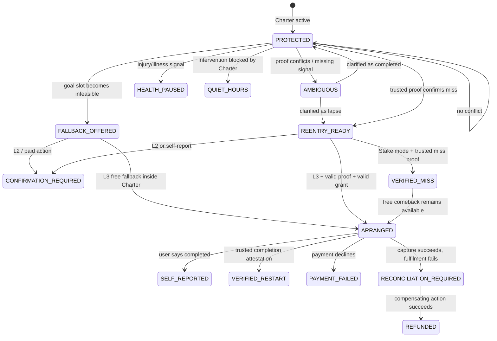

# Round 2 — Assembly submission v2

**Opening:** Sticking to the goal  
**Agent:** **Kal Se Nahi**  
**Core idea:** a **commitment compiler + zero-trust runtime**, not a motivation bot.

A user states a goal in ordinary language. Kal Se Nahi compiles it into a versioned **Goal Charter**: schedule, fallback ladder, evidence rules, autonomy, allowed actions, quiet hours and bounded money authority. At runtime, the language model may converse and suggest; a deterministic policy engine decides whether an action is permitted. The rails execute only what the Charter authorises.

The technical primitive that makes this different is **proof-gated delegation**: “this agent may spend up to ₹200” is insufficient. A consequential action should also be bound to the exact Charter version and the evidence condition that justified it.

---

## Q1. What is the outcome your agent is accountable for?

**Kal Se Nahi is accountable for keeping a chosen movement commitment alive: every at-risk session should end in verified original completion, verified fallback completion, or a verified re-entry within 24 hours of a confirmed lapse.**

Why this is measurable:
- original completion;
- fallback completion;
- re-entry after lapse;
- verification status is distinct from arrangement/payment.

---

## Q2. What level of autonomy does the agent have?

### L3

The most consequential thing Kal Se Nahi can do without asking again is move a **bounded amount of money** or apply a **bounded stake** under a Goal Charter the user explicitly approved in advance.

The autonomy is not global. It exists inside an **autonomy envelope**:

```
ALLOW(action) =
  charter_current
  AND grant_current
  AND action_in_allowlist
  AND evidence_confidence >= threshold(action)
  AND budget_ok
  AND time_ok
  AND safety_ok
```

Examples:
- calendar conflict → may prepare/offer a free fallback;
- verified miss → may execute an approved Recovery Credit action in L3;
- verified miss + separate Stake grant → may apply the bounded stake;
- self-reported lapse → offer options, but do not autonomously move money;
- ambiguous evidence / health flag / stale grant / outside limits → stop and ask.

This is **risk-adaptive L3**: more irreversible actions require stronger evidence.

It is not L4 because Kal Se Nahi cannot invent goals, choose arbitrary merchants, resolve ambiguous evidence by itself, or decide that a human outcome occurred without proof.

---

## Q3. What states does the agent go through?

Kal Se Nahi has two connected loops: **Protect Mode** before a miss and **Kal Se Nahi / Re-entry Mode** after a confirmed lapse.



### The key design rule

Kal Se Nahi always attempts the **least irreversible intervention** that can still save the commitment:

1. stay silent;
2. keep the original plan;
3. offer a smaller fallback;
4. use voice to negotiate;
5. arrange an approved recovery action;
6. apply a stake only under its separate rule.

Ambiguity moves the agent **down** the autonomy ladder, never up it.

### Distributed failure handling

Cross-rail actions use a saga pattern rather than pretending payment + booking + proof are one atomic API call:

```
PREPARE → AUTHORISE → EXECUTE → VERIFY
                  ↘ failure → RECONCILE / REFUND
```

A captured payment followed by failed fulfilment blocks a second debit until reconciliation.

---

## Q4. What does the agent use on each rail, and what must be built?

| Capability | State | Rail | Send | Receive | Failure | Must never | Today | Build |
|---|---|---|---|---|---|---|---|---|
| outbound intervention | at-risk / lapse | Gnani | phone, user label, Goal episode ref | call request + later conversation result | no answer, unwhitelisted number, provider error | call outside quiet hours | Trigger Test Call exists | connect to Kal Se Nahi scheduler |
| live conversation | check-in | Gnani | prompt, dynamic Goal Charter context | transcript / disposition | ASR ambiguity, language switch | treat conversational ambiguity as money authority | Agent Builder + STT/TTS exist | connect Agent Builder |
| on-call action | user chooses a path | Gnani | structured action request to our backend | allowed action / blocked reason | API timeout | bypass policy engine | custom HTTP actions exist | connect to `/goalguard/action` |
| low-confidence confirmation | consequential L2 choice | Gnani | exact numbered options | keypad digits | no input / invalid digit | infer a payment choice from noisy speech | DTMF exists | build confirmation policy |
| hosted consent | Charter authorisation | Pine Labs / Grantex | agent id, scopes, cap, expiry | grant token/id | denied/revoked/expired | expose grant token client-side | exists | integrate sandbox |
| agent payment | paid recovery | Pine Labs P3P | amount, resource, Grantex token | challenge → credential → capture → receipt | decline/pending/capture error | blind retry after uncertain capture | exists | integrate sandbox |
| **proof-gated delegation** | all autonomous money | Pine Labs + Proof rail | Charter hash + signed outcome attestation + ordinary grant | condition-valid / reject | proof stale / wrong goal / wrong Charter | let the agent self-assert the condition | **not documented as a Grantex scope primitive** | **proposed rail innovation** |
| route feasibility | protect original slot | Delhivery Maps | approved origin, gym/class destination | route duration/distance | route/address failure | treat proximity as attendance proof | routing + distance matrix exist | build Goal feasibility rule |

### Why the Pine gap matters

Grantex already answers:

> “May this agent initiate a payment, and what is the maximum amount?”

Kal Se Nahi needs the rail to be able to answer:

> “May this agent initiate **this** payment **because this exact user-approved behavioural condition has been satisfied**?”

We call the missing primitive a **Conditional Agent Grant**.

Example:

```json
{
  "grant_scope": "mpp:payment:initiate",
  "max_txn_paise": 20000,
  "goal_id": "gym_mwf_1900",
  "charter_version": 4,
  "condition": "verified_miss",
  "evidence_schema": "outcome-attestation/v1",
  "expires_at": "..."
}
```

At execution, the agent supplies a signed attestation issued by the Proof Rail. The payment rail—not the LLM—checks that the condition matches.

That makes behavioural money **zero-trust**.

### Delhivery is deliberately not forced

Round 1 treated logistics as optional. After reading Delhivery Maps, we found a better fit: route intelligence can decide whether the **original physical goal is still feasible before giving up on it**. We do not claim Maps books a class or proves attendance.

---

## Q5. Does the agent need a fourth rail?

### Yes — an **Outcome Attestation Rail**

Voice proves a conversation occurred. P3P proves money moved. Delhivery proves a route is feasible. None of them proves:

> “Did the human actually do the thing?”

The Outcome Attestation Rail would let approved issuers—e.g. a gym QR system, Health Connect-connected fitness app, learning platform, or savings platform—return only the minimum proof Kal Se Nahi needs.

```json
{
  "goal_id": "gym_mwf_1900",
  "event": "attendance",
  "window": "2026-09-24T18:45/20:30+05:30",
  "result": "pass | fail | unknown",
  "issuer": "provider-id",
  "confidence": 0.98,
  "consent_receipt": "consent-id",
  "signature": "..."
}
```

Kal Se Nahi receives **pass/fail/unknown**, not raw GPS trails, messages or full health history.

### Company: Finvu (Cookiejar Technologies)

We would want **Finvu**, an RBI-regulated Indian Account Aggregator, to build this as a new non-financial attestation rail. The reason is architectural, not because Finvu currently has fitness data: Account Aggregators are designed to be **data-blind consent infrastructure**. Finvu already manages purpose-bound, revocable consent and digitally signed consent artefacts for verified financial data.

The proposed rail would extend that design pattern—not the regulated AA data scope—to behavioural issuers such as gym QR systems, Health Connect-connected apps or learning platforms. Finvu would route the user's consent and the signed minimum attestation; it would not need to store the raw underlying behavioural history.

That makes the fourth rail neutral infrastructure instead of another habit app.

---

## Q6. How does a human interact with the agent?

Two surfaces, because setup and intervention are different jobs.

### 1. Goal Charter — lightweight companion screen, used rarely

User sets:
- routine, days, time, flexibility;
- fallback ladder;
- evidence sources;
- allowed actions;
- quiet hours;
- language;
- L2/L3;
- **Recovery Credit / Commitment Stake / No Money**;
- per-action and total/weekly caps.

Saving the Charter does **not** grant financial authority. Money permission is a separate step. Editing the Charter invalidates the old grant.

### 2. Gnani voice — intervention surface, used only when the state changes

Before a miss:

> “Your 7 PM gym slot is no longer reachable after the meeting. Your Charter allows a 20-minute home fallback. Should I protect that instead?”

After a confirmed lapse:

> “The session was missed. I can make the comeback small: your free 20-minute home reset, or your approved ₹180 studio restart.”

For L2, the exact action is confirmed every time. If ASR is uncertain for a consequential choice, the voice flow can fall back to DTMF instead of guessing.

For L3, a choice inside the exact Charter can execute without another approval; outside the Charter, Kal Se Nahi stops.

The companion screen shows:
- current state;
- evidence used;
- rule that allowed/blocked the action;
- price/merchant;
- receipt;
- self-report vs verified proof;
- pause/revoke;
- audit trail.

---

## Q7. What is the name?

# **Kal Se Nahi**

One agent handles both parts of the commitment lifecycle: **Protect Mode** before a miss and **Re-entry Mode** after one.

**Tagline:** *Protect the promise. Make the comeback small.*

---

## Q8. Which Indian company has the best chance of building this?

### Cult.fit

Cult.fit already sits closest to the full movement loop:
- bookable group classes;
- partner gyms;
- at-home alternatives;
- membership/payment relationship;
- mandatory QR check-in / class attendance.

That gives it something ordinary habit apps lack: **intent, intervention inventory and proof** in the same system.

But Kal Se Nahi is not simply a Cult.fit feature. Its differentiator is the cross-context **Goal Charter**: it can defend a commitment against calendar conflict, route feasibility and user-authorised external rails, distinguish ambiguity from failure, and carry the commitment logic beyond fitness into study or savings.

This intentionally preserves our Round 1 answer rather than changing companies between rounds.

---

## Evidence continuity from Round 1

Our 15-response student survey did not say “everyone wants punishment.” It showed something more useful: users selected mechanisms that make a goal less private, less reversible or less costless. Financial penalty was the most-selected option, while proxy accountability, public commitment, gamification/stakes, self-directed support and social shame also appeared.

So Round 2 does **not** erase the Commitment Stake. The Charter lets the user choose among:
- **Commitment Stake** — cost of a verified miss;
- **Recovery Credit** — committed money spent only to reduce re-entry friction;
- **No Money** — free fallback/accountability only.

The agent never silently chooses the accountability philosophy for the user.

---

## Prototype truth statement

The current repo is an executable policy prototype, not a fully integrated production agent.

Implemented:
- Goal Charter and versioning;
- deterministic policy engine;
- L2/L3;
- Recovery Credit / Stake / no-money separation;
- ambiguity, quiet hours, injury pause;
- idempotency and reconciliation;
- self-report vs verified proof distinction;
- audit trail;
- optional local LLM for wording with no tool authority;
- Gnani REST TTS adapter.

Simulated/not connected:
- Pine Labs/Grantex transactions;
- class booking and attendance;
- Delhivery Maps;
- Gnani outbound telephony/STT.

This boundary is intentional: the prototype proves the **agent contract** and failure logic; the assembly specifies how real rail primitives replace the simulated adapters.
